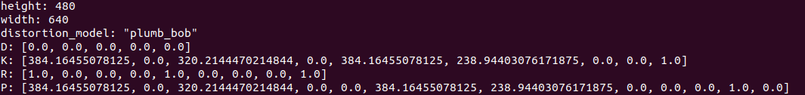

#  COVIS
Collaborative Outlier-free Visual Inertial SLAM system
### 1-Video


### 2-Relevent Publication:

### 3-Support Hardware/Dataset:
Intel RealSense Camera <br />
EuRoC MAV Dataset <br />
KITTI Dataset <br />

### 4-Build The Project
We have tested in the following environment: <br />
Ubuntu 16.04 + ROS Kinetic <br />
Ubuntu 18.04 + ROS melodic <br />
Clone the repository to the catkin work space eg. `/catkin_ws/src`
````
git clone https://github.com/PAIR-Lab/COVIS.git
````
Install 3rd Part library
````
cd catkin_ws/src/COVIS/3rdPartLib/
./install3rdPartLib.sh
````
Compile
````
cd ~/catkin_ws
catkin_make
````
### 5-Verification
Support Platform D435i(Depth/Stereo Mode), EuRoC Dataset, KITTI Dataset
#### 5.1 D435i Camera Depth Mode
##### 5.1.1 Use our recorded rosbag 

Decompress the rosbag and put them in ````/bag```` folder:
````
rosbag decompress drone0.bag drone1.bag
````
run ````rviz```` and launch ````Server````:
````
roslaunch covis rviz_Server.launch 
roslaunch covis Server.launch 
````
run ````client0```` and ````client1```` in different terminal:
````
roslaunch covis covis_bag_0.launch 
roslaunch covis covis_bag_1.launch 
````
##### 5.1.2 Use your own camera:
Install the [realsense driver](https://github.com/IntelRealSense/librealsense) and its [ros wrapper](https://github.com/IntelRealSense/realsense-ros) <br />
Boot the d435i camera and echo the camera infomation
````
roslaunch covis covis_C0.launch 
rostopic echo /Agent0/camera/infra1/camera_info
````
You will get the camera infomation like:

As shown, where the resolution is 640x480 and `fx=384.16455078125; fy=384.16455078125; cx=320.2144470214844;cy=238.94403076171875.` <br />
Edit these information in the config yaml file (say: `/launch/d435i/sn943222072828_depth.yaml`):
```yaml
image_width: 640
image_height: 480
cam0_intrinsics: [384.16455078125, 384.16455078125, 320.2144470214844, 238.94403076171875]#fx fy cx cy
cam0_distortion_coeffs: [0.0, 0.0, 0.0, 0.0]#k1 k2 r1 r2
```
In the launch file ````covis_C0.launch````, make sure ````/yamlconfigfile```` is point to the edited config file
````
<param name="/yamlconfigfile" type="string" value="$(find covis)/launch/d435i/d435_depth.yaml"/>
````
run the following launch files:
````
roslaunch covis rviz_bag.launch
roslaunch covis covis_d435i_depth.launch
````
#### 5.2 D435i Camera Stero Mode
Like what we did in 5.1.2, we need to config the `sn943222072828_stereo.yaml` <br />
Note that, by default the two camera share the same intrinsic parameters, and the baseline length is 0.05m:
```yaml
cam0_intrinsics: [384.16455078125, 384.16455078125, 320.2144470214844, 238.94403076171875]#fx fy cx cy
cam0_distortion_coeffs: [0.0, 0.0, 0.0, 0.0]#k1 k2 r1 r2
cam1_intrinsics: [384.16455078125, 384.16455078125, 320.2144470214844, 238.94403076171875]#fx fy cx cy
cam1_distortion_coeffs: [0.0, 0.0, 0.0, 0.0]#k1 k2 r1 r2
T_cam0_cam1:
[ 1.0,  0.0,  0.0,  0.05,
  0.0,  1.0,  0.0,  0.0,
  0.0,  0.0,  1.0,  0.0,
  0.0,  0.0,  0.0,  1.0]

```

#### 5.3 EuRoC MAV Dataset
Download the dataset(say MH_05_difficult) into the bag folder:
````
roscd covis/bag/
wget http://robotics.ethz.ch/~asl-datasets/ijrr_euroc_mav_dataset/machine_hall/MH_05_difficult/MH_05_difficult.bag
````
Edit the corresponding bag name in `covis_euroc_mav.launch` file:
````
<node pkg="rosbag" type="play" name="rosbag" args="$(find covis)/bag/MH_05_difficult.bag"/>
````
run ````rviz```` and launch ````Server````:
````
roslaunch covis rviz_Server.launch 
roslaunch covis Server.launch 
````
run ````client1````,````client2````,````client3```` in different terminal:
````
roslaunch covis covis_euroc_1.launch
roslaunch covis covis_euroc_2.launch
roslaunch covis covis_euroc_3.launch
````

#### 5.4 KITTI Dataset
Download the dataset into the bag folder:

 

Decompress `poses.zip` file and edit the corresponding bag name in `covis_kitti.launch` file:
````
<param name="/publish_gt"             type="bool"    value="true" />
<param name="/dataset_folder_path"    type="string"  value="$(find covis)/bag/KITTI/dataset/sequences/00/" />
<param name="/dataset_gt_file"        type="string"  value="$(find covis)/bag/KITTI/dataset/poses/00.txt" />
````
run ````rviz```` and launch ````Server````:
````
roslaunch covis rviz_kitti.launch 
roslaunch covis Server_kitti.launch 
````
run ````client1````,````client2````,````client3```` in different terminal:
````
roslaunch covis covis_kitti.launch

````

### Maintainer:
[Yurong Feng](https://www.polyu.edu.hk/researchgrp/cywen/index.php/en/people/current-members.html)(Dept.AAE,PolyU): yu-rong.feng@connect.polyu.hk <br />
[Shengyang Chen](https://www.polyu.edu.hk/researchgrp/cywen/index.php/en/people/alumni.html)(Dept.ME,PolyU): shengyang.chen@connect.polyu.hk <br />


